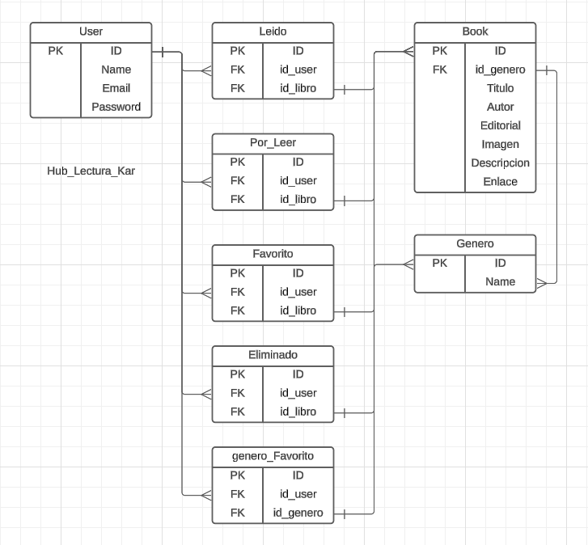

# Hub-Lectura (Librería digital con Visual Basic 6)

 Karla Jimenez Molina 

# Descripcion

Esta Sprint muestra una  biblioteca de libros utilizando Visual Basic 6, con diferentes funciones haciendo una conexión con una base de datos creada en SQL Server. Se puede explorar una amplia gama de libros de diversos géneros literarios. 

# Objetivos

* Crear una base de datos con SQL Server.
* Implementar una interfaz gráfica en Windows utilizando Visual Basic 6.
* Crear una herramientas de Visual Basic, utilizando botones para la ejecución de funciones específicas.
* Guardar los datos generados en la base de datos de SQL Server.
* Crear perfiles de usuario para que cada persona pueda personalizar su experiencia dentro del sistema.

# Requerimientos técnicos

*Visual Basic 6
* SQL Server Management Studio 20

# Visualización del proyecto

# Instrucciones para su instalacion

* Clonar el proyecto.
* Descargar e instalar Visual Basic 6.
* Acceder a Visual Basic 6.
* Seleccionar la opción de "Archivo" y luego, seleccionar "Abrir archivo".
*En la ubicación donde se descargó la carpeta, abrir el archivo “programa_libreria.vbp”.

¡Listo! El proyecto está disponible.

Para enlazar la base de datos al sistema:
* Importe los datos de la carpeta “base_datos” en una base de datos en SQL Server.
* Una vez importados, en Visual Basic 6, diríjase a la sección de módulos y en la siguiente línea, ingrese sus credenciales para que el sistema se conecte con la base de datos:

Con.Open "Driver={SQL Server}; 
    Server= TU SERVIDOR; 
    Database= NOMBRE DE TU BASE DE DATOS; 
    User Id= TU USUARIO; 
    Password= TU CONTRASEÑA;"
    
¡Listo! El proyecto estará conectado con su base de datos SQL Server.

# Descripción de como se realizo

1. Tomar sesiones con el Callenger, fue de gran ayuda para reforzar mis habilidades en bases de datos y adquirí el conocimiento necesario para conectar la base de datos con el sistema mediante módulos.
2. Este proyecto fue desarrollado en conjunto con un equipo de compañeros, lo que facilitó un mayor respaldo y el cumplimiento eficiente de los objetivos.
3. Se realizó una base de datos.
4. En Visual Basic 6 se hizo la conexión y se realizaron pruebas para comprobar que estuviera enlazando los datos.
5. Se comenzó a realizar el Form principal, agregando algunos componentes, botones, asi como opciones de menú, de manera que tuviera rutas.
6. Los datos agregados en Generos Favoritos y Recomendaciones se comprobaron que estuvieran guardandose en la BD con los usuarios correspondientes.
7. Se comprobó que todo funcionara de manera satisfactoria, solo faltaron algunos detalles.

# Problemas conocidos

* Aprender como manejar y las funciones dentro de Visual Basic 6
*Crear la conexión a la base de datos para acceder a los registros disponibles

# Retrospectiva

| Aspecto                    | Detalles                                                                                                                                                                                                                                                                                                               |
|--------------------------------|-----------------------------------------------------------------------------------------------------------------------------------------------------------------------------------------------------------------------------------------------------------------------------------------------------------------------------|
| ¿Qué salió bien?           | * Aprender los conceptos y herramientas a ocupar   * Senti que mi conocimiento se amplio permitiendome desarrollar el proyecto   |
| ¿Qué puedo hacer diferente? | * Dedicarle más tiempo a comprender Visual Basic.   * Facilitar la forma de realizar mi conexion de base de daots para no tardar tanto.   *El verdadero desafío fue conectar esta base de datos con Visual Basic 6|
| ¿Qué no salió bien?        | * A inicios de semana mi computadora fallo y me costo mucho entontrar una computadora que fuera funcional y poder realoar el proyecto.   *Siento que pude hacerlo mejor, pero no ayudo que mi computadora se descompusiera, pero hice todo lo posible por terminar| 

